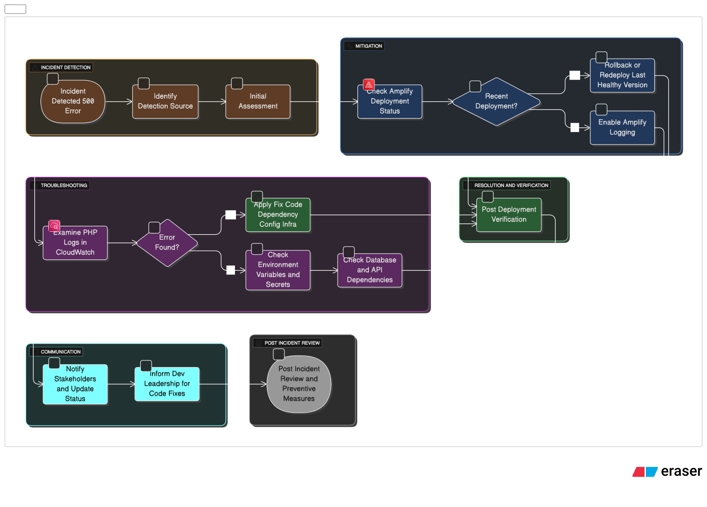

# Incident Response Runbook: PHP 500 Errors on AWS Amplify

## 1. Incident Identification

- **Trigger:** Frontend users report HTTP 500 errors.
- **Detection sources:**
  - CloudWatch alarms (5xx error rate)
  - Application logs / monitoring dashboard
  - User tickets / Slack notifications

**Initial Assessment Questions:**
1. Is the issue affecting all users or specific routes?
2. Did a deployment or configuration change happen recently?
3. Are other environments (staging, dev) affected?

## 2. Immediate Mitigation Steps

1. **Check AWS Amplify deployment status**
   ```bash
   aws amplify get-app --app-id <app-id>
   aws amplify list-branches --app-id <app-id>
   ```
   - Look for failed builds or recent rollbacks.

2. **Rollback (if recent deployment is suspected)**
   - Identify the last known healthy deployment:
     ```bash
     aws amplify list-deployments --app-id <app-id> --branch-name <branch>
     ```
   - Redeploy or rollback to that version.

3. **Enable Amplify logging**
   - Go to **Amplify Console → App → Monitoring → Logs**
   - Enable full **backend + frontend logs** if not already active.

## 3. Troubleshooting

1. **Examine PHP error logs**
   - Amplify logs are stored in CloudWatch by default:
     ```
     /aws/amplify/<app-name>/branch/<branch-name>/
     ```
   - Look for:
     - Syntax errors or fatal errors
     - Undefined functions / missing extensions
     - Runtime exceptions

2. **Check PHP version and dependencies**
   - Ensure PHP 8 runtime matches your application requirements.
   - Verify all Composer dependencies are installed and compatible:
     ```bash
     composer install --no-dev
     composer outdated
     ```

3. **Test locally / staging**
   - Pull the same commit / branch and test with PHP 8 locally.
   - Confirm if the 500 occurs in a controlled environment.

4. **Check environment variables & secrets**
   - Misconfigured secrets (DB, API keys) often cause 500 errors.
   - Validate **Amplify environment variables** and **Secrets Manager** values.

5. **Check database / API dependencies**
   - Verify connectivity and availability of any external services.
   - Ensure credentials are not expired or misconfigured.

## 4. Communication

- **Notify stakeholders**
  - DevOps/SRE team
  - Product owner / affected business units
- **Provide status updates** every 15–30 minutes until resolved.

## 5. Resolution

1. Apply fixes based on root cause:
   - **Code issue:** deploy hotfix or rollback
   - **Dependency issue:** update / reinstall dependencies
   - **Configuration / secret issue:** correct environment variables
   - **Infrastructure issue:** verify AWS service health (Amplify, RDS, etc.)

2. **Post-deployment verification**
   - Smoke test critical routes
   - Check CloudWatch metrics for 5xx error rate drop
   - Validate user reports that the issue is resolved

## 6. Post-Incident Review

- Document:
  - Root cause
  - Timeline of detection, mitigation, and resolution
  - Lessons learned
  - Preventive measures (monitoring, alerts, code review)

- Update monitoring and alerting rules:
  - Set Amplify-specific alarms (5xx rate threshold, build failures)
  - Improve logging if gaps were found

## 7. References

- [AWS Amplify Console Logging](https://docs.aws.amazon.com/amplify/latest/userguide/monitoring.html)
- [PHP 8 Error Handling](https://www.php.net/manual/en/language.errors.php)
- [CloudWatch Logs Insights](https://docs.aws.amazon.com/AmazonCloudWatch/latest/logs/CWL_QuerySyntax.html)

---

# Step-by-Step Diagram

